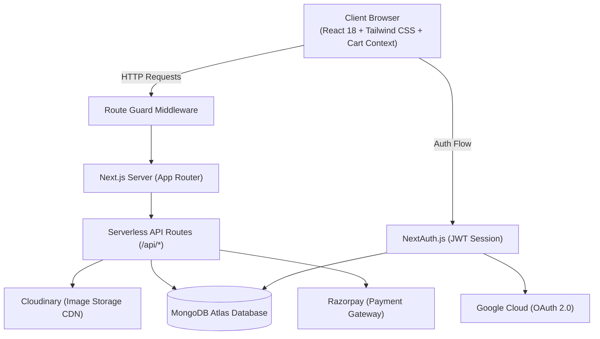

# 🍕 Food Ordering & Restaurant Management Web App

[](https://nextjs.org/)
[](https://reactjs.org/)
[](https://tailwindcss.com/)
[](https://www.mongodb.com/)
[](https://next-auth.js.org/)
[](https://razorpay.com/)
[](https://cloudinary.com/)

A modern, full-stack food ordering platform and restaurant management system engineered with **Next.js 15 (App Router)**, **React 18**, **MongoDB**, and **Tailwind CSS**. Features real-time cart customization, secure authentication (Credentials + Google OAuth), integrated **Razorpay** online payments, and an administrative control panel for menu and category management.

---

## 📑 Documentation Index

Comprehensive technical documentation is organized in the [`docs/`](./docs) directory:

- 🏗️ **[System Architecture & Workflows](./docs/ARCHITECTURE.md)**: Architecture diagrams, payment verification lifecycle, and access control.
- 🗄️ **[Database Schema & ERD](./docs/DATABASE_SCHEMA.md)**: Mongoose schemas, sub-documents, entity relationship diagrams, and field constraints.
- 🔌 **[REST API Specification](./docs/API.md)**: Complete route reference, request/response models, and status codes.
- ⚙️ **[Developer Setup & Third-Party Guide](./docs/SETUP_GUIDE.md)**: Detailed walkthrough for MongoDB, Google OAuth, Razorpay, and Cloudinary.

---

## 🌟 Key Features

### 🛒 Customer Experience
- **Interactive Food Catalog**: Filter menu items dynamically by category (Pizzas, Burgers, Sides, Beverages, Desserts).
- **Product Customization**: Select dish sizes (Small, Medium, Large) and optional add-on toppings with dynamic price calculation.
- **Persistent Shopping Cart**: Real-time cart state managed through React Context and persisted per user in `localStorage`.
- **Integrated Payments**: Frictionless online checkout powered by **Razorpay** supporting UPI, NetBanking, and Cards.
- **Order Tracking**: Real-time order status tracking with verified payment confirmation badges.
- **Address & Profile Management**: Save contact information, street address, and postal details for faster reordering.

### 🛡️ Authentication & Authorization
- **Dual Authentication**: Sign in with Email/Password (salted bcrypt encryption) or 1-click **Google OAuth 2.0**.
- **Role-Based Access Control (RBAC)**: Secure server-side validation (`isAdmin()` helper) restricting administrative routes and APIs.
- **Route Guard Middleware**: Automatic redirection to login for protected pages (`/cart`, `/profile`, `/orders`, `/users`).

### ⚡ Restaurant Administration Panel
- **Category Management**: Create, edit, and remove menu categories in real time.
- **Menu Item Customizer**: Create dishes with high-resolution image uploads (via Cloudinary), custom sizes, and extra ingredient pricing tiers.
- **Order Management**: Monitor all incoming orders across the platform and view detailed payment fulfillment statuses.
- **User Directory**: View registered customers and grant or revoke administrative permissions.

---

## 📐 System Architecture



---

## 🛠️ Technology Stack

| Domain | Technology / Library | Purpose |
| :--- | :--- | :--- |
| **Framework** | [Next.js 15](https://nextjs.org/) (App Router) | Full-stack React framework with server-side rendering & route handlers |
| **UI Library** | [React 18](https://reactjs.org/) | Declarative component hierarchy and hooks |
| **Styling** | [Tailwind CSS 3.4](https://tailwindcss.com/) | Responsive, utility-first styling system |
| **Database** | [MongoDB Atlas](https://www.mongodb.com/) via [Mongoose 8](https://mongoosejs.com/) | NoSQL persistence with structured schema enforcement |
| **Authentication** | [NextAuth.js 4](https://next-auth.js.org/) | Session handling, Credentials provider, and Google OAuth 2.0 |
| **Payments** | [Razorpay SDK](https://razorpay.com/) | Merchant payment processing and cryptographic signature verification |
| **Media Hosting** | [Cloudinary SDK](https://cloudinary.com/) | Scalable CDN media management for dish and avatar uploads |
| **Notifications** | [React Hot Toast](https://react-hot-toast.com/) & [React Toastify](https://fkhadra.github.io/react-toastify/) | Interactive user alerts and feedback |

---

## 🚀 Quick Start Guide

### Prerequisites
- Node.js `18.17.0` or higher
- MongoDB Atlas cluster URI
- Razorpay Test Key ID & Secret
- Cloudinary Account credentials
- Google OAuth 2.0 Client ID & Secret

### 1. Installation
Clone the repository and install dependencies:
```bash
git clone <repository-url>
cd food-ordering
npm install
```

### 2. Configure Environment Variables
Copy the template file to `.env`:
```bash
cp .env.example .env
```
Fill in your credentials in `.env`:
```env
NEXT_MONGO_URL=mongodb+srv://<user>:<password>@cluster0.example.mongodb.net/food-ordering?retryWrites=true&w=majority
NEXTAUTH_SECRET=your_super_secret_jwt_string
NEXTAUTH_URL=http://localhost:3000

NEXT_PUBLIC_RAZORPAY_KEY_ID=rzp_test_xxxxxx
NEXT_RAZORPAY_KEY_ID=rzp_test_xxxxxx
NEXT_RAZORPAY_KEY_SECRET=xxxxxx

NEXT_GOOGLE_CLIENT_ID=xxxxxx.apps.googleusercontent.com
NEXT_GOOGLE_CLIENT_SECRET=xxxxxx

CLOUDINARY_CLOUD_NAME=xxxxxx
CLOUDINARY_API_KEY=xxxxxx
CLOUDINARY_API_SECRET=xxxxxx
```
*(For complete setup instructions, refer to [docs/SETUP_GUIDE.md](./docs/SETUP_GUIDE.md)).*

### 3. Launch Development Server
```bash
npm run dev
```
Open [http://localhost:3000](http://localhost:3000) to view the application in your browser.

---

## 📂 Project Structure

```
food-ordering/
├── .env.example                 # Environment variables reference template
├── package.json                 # Project dependencies & scripts
├── next.config.mjs              # Next.js configurations & remote image domains
├── tailwind.config.js           # Tailwind CSS design system tokens
├── docs/                        # Complete project documentation
│   ├── ARCHITECTURE.md          # Architecture, workflows & payment lifecycle
│   ├── DATABASE_SCHEMA.md       # Database models, schemas, and ERD
│   ├── API.md                   # REST API documentation
│   └── SETUP_GUIDE.md           # Local setup and cloud service instructions
└── src/
    ├── middleware.js            # Route protection and authorization guards
    ├── libs/                    # Shared database and datetime helpers
    ├── components/              # Reusable UI, Layout, Menu, and Context components
    └── app/
        ├── layout.js            # Global layout with AppContext provider
        ├── page.js              # Home landing page with specials & hero
        ├── models/              # Mongoose data models
        ├── api/                 # Serverless REST endpoints
        ├── cart/                # Checkout & cart page
        ├── menu/                # Food menu browsing page
        ├── orders/              # Order history & tracking
        ├── profile/             # User profile & address editor
        ├── categories/          # [Admin] Category management
        ├── menu-items/          # [Admin] Menu item creation & editing
        └── users/               # [Admin] User administration
```

---

## 🔒 Security Best Practices Implemented

- **Password Hashing**: Passwords stored using industry-standard `bcrypt` with salt rounds.
- **Payment Verification**: Razorpay transactions verified server-side with HMAC SHA-256 signatures prior to order confirmation.
- **Input Sanitization & RBAC**: Admin-only mutations (menu items, categories, roles) validated against database session claims.
- **Serverless Cloud CDN**: Uploaded media streams directly to Cloudinary without persisting temporary files to disk.

---

## 📄 License

This project was developed for educational and demonstration purposes.
