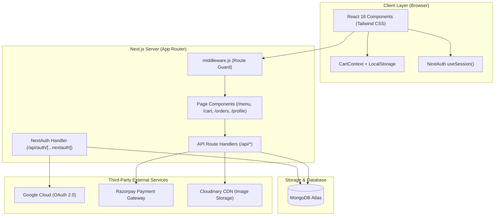
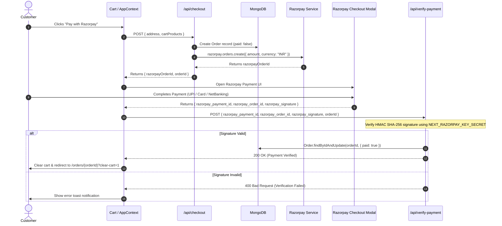

# System Architecture & Design

This document details the architectural layout, system components, authentication mechanics, and transaction lifecycle of the **Food Ordering Web Application**.

---

## 1. High-Level Architecture

The system follows a modern full-stack serverless architecture powered by **Next.js 15 (App Router)**, integrating external microservices for media storage, identity provider (OAuth), and payment gateway processing.



---

## 2. Component Layers

### 2.1. Presentation & State Management Layer
- **Framework**: Next.js 15 with React 18 and Tailwind CSS for utility-first styling.
- **Client State**:
  - **CartContext** ([`src/components/AppContext.js`](file:///d:/Sunbeam/Project/food-ordering/src/components/AppContext.js)): Manages shopping cart state across sessions, storing customized items (including selected sizes and add-on ingredients). State is backed by `window.localStorage` keyed per authenticated user (`cart_${email}`).
  - **SessionProvider**: Exposes real-time authentication session state to client components.
- **Notifications**: Toast notifications via `react-toastify` and `react-hot-toast` for user actions (cart additions, profile updates, order notices).

### 2.2. Application & API Routing Layer
- **Middleware Guard** ([`src/middleware.js`](file:///d:/Sunbeam/Project/food-ordering/src/middleware.js)): Intercepts requests to protected user routes (`/cart`, `/profile`, `/orders`, `/users`) and redirects unauthenticated users to `/login`.
- **Next.js Route Handlers** (`src/app/api/*`): Serve RESTful endpoints for CRUD operations on menu items, categories, orders, user profiles, and image uploads.

### 2.3. Data & Persistence Layer
- **Mongoose ODM**: Handles schema definitions, validation, and interaction with MongoDB.
- **Connection Optimization**: Managed in [`src/libs/mongoConnect.js`](file:///d:/Sunbeam/Project/food-ordering/src/libs/mongoConnect.js) and database reconnect logic across serverless route handlers to reuse connections between hot invocations.

---

## 3. Security & Access Control (RBAC)

The application enforces a two-tier Role-Based Access Control model: **Customer** and **Admin**.

```mermaid
flowchart TD
    Req[Incoming Client Request] --> AuthCheck{Is User Logged In?}
    AuthCheck -- No --> RejectAuth[401 Unauthorized / Redirect to /login]
    AuthCheck -- Yes --> AdminCheck{Requires Admin Privileges?}
    AdminCheck -- No --> AllowUser[Process Customer Request]
    AdminCheck -- Yes --> VerifyAdmin{isAdmin() helper verification}
    VerifyAdmin -- Yes --> AllowAdmin[Execute Admin Operation (CRUD Items, Categories, Users)]
    VerifyAdmin -- No --> RejectForbidden[403 Forbidden]
```

### Authorization Check Implementation
Admin privileges are verified on the backend via the `isAdmin()` helper located in [`src/app/api/auth/[...nextauth]/route.js`](file:///d:/Sunbeam/Project/food-ordering/src/app/api/auth/%5B...nextauth%5D/route.js):
1. Retrieves the active server session via `getServerSession(authOptions)`.
2. Checks both the `User` and `UserInfo` collections in MongoDB for `{ email, admin: true }`.
3. Route handlers for categories, menu items, and user administration reject non-admin operations with HTTP `403 Forbidden`.

---

## 4. End-to-End Payment & Order Lifecycle

The payment flow leverages **Razorpay** with backend signature verification using cryptographic hashing (HMAC SHA-256).



---

## 5. Media Upload Architecture

To handle item photos and user profile pictures safely without server filesystem dependencies:

1. Client selects a file via an `<input type="file">`.
2. Form data is dispatched to [`/api/upload`](file:///d:/Sunbeam/Project/food-ordering/src/app/api/upload/route.js).
3. The server buffers the stream, formats it as a Data URI (`data:<type>;base64,...`), and uploads it to **Cloudinary** under the `food-ordering` folder.
4. Cloudinary returns a secure CDN URL (`https://res.cloudinary.com/...`), which is saved to the database.

---

## 6. Directory Layout & Organization

```
food-ordering/
├── .env.example               # Template for environment configuration
├── package.json               # Node modules, scripts, and dependencies
├── next.config.mjs            # Next.js runtime configuration
├── tailwind.config.js         # Styling tokens and Tailwind settings
├── src/
│   ├── middleware.js          # Route protection middleware
│   ├── libs/
│   │   ├── mongoConnect.js    # MongoDB client connection caching
│   │   └── datetime.js        # Date/time formatting helpers
│   ├── components/
│   │   ├── AppContext.js      # CartContext provider and local storage sync
│   │   ├── UseProfile.js      # Custom React hook for fetching user profile/admin state
│   │   ├── DeleteButton.js    # Reusable modal confirmation delete component
│   │   ├── icons/             # Custom SVG icons
│   │   ├── layout/            # Navbar, Header, Footer, Hero, HomeMenu
│   │   └── menu/              # MenuItem card, MenuItemTile, CartProduct
│   └── app/
│       ├── layout.js          # Root layout with AppContext provider
│       ├── page.js            # Landing page (Hero, Specials, About, Contact)
│       ├── models/            # Mongoose Schemas (User, UserInfo, Category, MenuItem, Order)
│       ├── api/               # Serverless Route Handlers
│       │   ├── auth/          # NextAuth configuration and providers
│       │   ├── categories/    # Category CRUD endpoints
│       │   ├── checkout/      # Razorpay order generation & order logging
│       │   ├── menu-items/    # Dish CRUD with size/addon options
│       │   ├── orders/        # Order retrieval and tracking
│       │   ├── profile/       # User profile and address manager
│       │   ├── register/      # User registration endpoint
│       │   ├── upload/        # Cloudinary image uploader
│       │   ├── users/         # Admin user directory
│       │   └── verify-payment/# Cryptographic payment verification
│       ├── cart/              # Cart & delivery address page
│       ├── categories/        # Admin category manager page
│       ├── menu/              # Public catalog page
│       ├── menu-items/        # Admin menu item list and editor pages
│       ├── orders/            # Customer and Admin orders list & tracking
│       ├── profile/           # User profile settings page
│       └── register/ & login/ # Authentication pages
└── docs/                      # Technical Documentation
    ├── ARCHITECTURE.md        # System design & workflow specification
    ├── DATABASE_SCHEMA.md     # MongoDB entity structures & ERD
    ├── API.md                 # REST API reference guide
    └── SETUP_GUIDE.md         # Local installation & deployment guide
```
