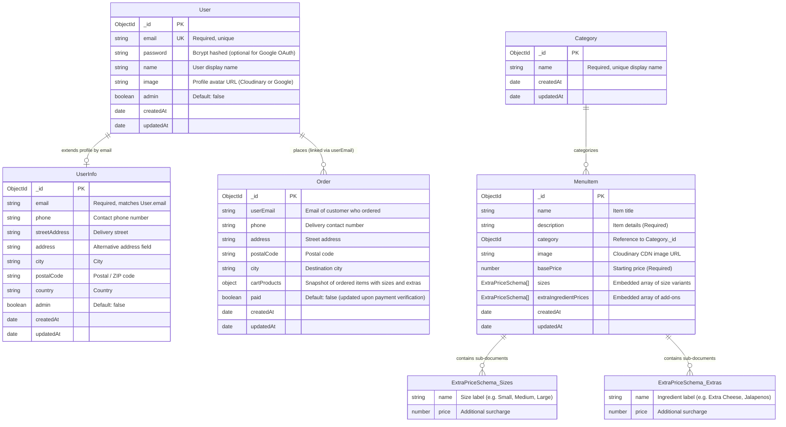

# Database Schema & Entity Design

This document details the MongoDB data models, relations, field constraints, and schemas implemented using **Mongoose** for the food ordering platform.

---

## 1. Entity-Relationship Diagram (ERD)



---

## 2. Model Specifications

### 2.1. User Model
Defined in: [`src/app/models/user.js`](file:///d:/Sunbeam/Project/food-ordering/src/app/models/user.js)

Stores authentication credentials and account identity. Compatible with both **CredentialsProvider** (email/password) and **GoogleProvider** (OAuth 2.0).

| Field | Type | Constraints | Description |
| :--- | :--- | :--- | :--- |
| `_id` | `ObjectId` | Primary Key, Auto | Internal MongoDB identifier |
| `email` | `String` | Required, Unique | User email address used for login and notifications |
| `password` | `String` | Optional | Salted bcrypt hash; omitted for OAuth accounts |
| `name` | `String` | Optional | Full name of the user |
| `image` | `String` | Optional | Hosted URL of the profile avatar |
| `admin` | `Boolean` | Default: `false` | Determines superuser/admin privileges |
| `createdAt` | `Date` | Auto | Timestamp of account registration |
| `updatedAt` | `Date` | Auto | Timestamp of last profile update |

---

### 2.2. UserInfo Model
Defined in: [`src/app/models/userInfo.js`](file:///d:/Sunbeam/Project/food-ordering/src/app/models/userInfo.js)

Maintains customer contact and shipping delivery addresses, decoupled from the core credentials collection to support flexible profile updates and NextAuth session adaptation.

| Field | Type | Constraints | Description |
| :--- | :--- | :--- | :--- |
| `_id` | `ObjectId` | Primary Key, Auto | Internal identifier |
| `email` | `String` | Required | Linked to `User.email` |
| `phone` | `String` | Optional | Contact phone number for delivery updates |
| `streetAddress` | `String` | Optional | Primary street name and building/apartment |
| `address` | `String` | Optional | Legacy address alias |
| `city` | `String` | Optional | City name |
| `postalCode` | `String` | Optional | Postal code / PIN code |
| `country` | `String` | Optional | Country name |
| `admin` | `Boolean` | Default: `false` | Redundant role check for user administration |
| `createdAt` | `Date` | Auto | Created timestamp |
| `updatedAt` | `Date` | Auto | Last modified timestamp |

---

### 2.3. Category Model
Defined in: [`src/app/models/Categories.js`](file:///d:/Sunbeam/Project/food-ordering/src/app/models/Categories.js)

Organizes menu items into browseable groups (e.g. *Pizza*, *Burgers*, *Beverages*, *Desserts*).

| Field | Type | Constraints | Description |
| :--- | :--- | :--- | :--- |
| `_id` | `ObjectId` | Primary Key, Auto | Unique category ID |
| `name` | `String` | Required | Display name of the category |
| `createdAt` | `Date` | Auto | Creation date |
| `updatedAt` | `Date` | Auto | Last edited date |

---

### 2.4. MenuItem Model & Embedded Sub-documents
Defined in: [`src/app/models/MenuItem.js`](file:///d:/Sunbeam/Project/food-ordering/src/app/models/MenuItem.js)

Represents dishes available for ordering, including support for variable sizing and custom ingredients.

#### Sub-Schema: `ExtraPriceSchema`
```javascript
{
  name: String,   // Label, e.g. "Large" or "Extra Cheese"
  price: Number   // Price increment in INR
}
```

#### Main Schema: `MenuItemSchema`
| Field | Type | Constraints | Description |
| :--- | :--- | :--- | :--- |
| `_id` | `ObjectId` | Primary Key, Auto | Unique dish ID |
| `name` | `String` | Optional | Dish name |
| `description` | `String` | Required | Detailed description of the dish |
| `category` | `ObjectId` | Optional | Refers to `Category._id` |
| `image` | `String` | Optional | Cloudinary CDN link of dish photo |
| `basePrice` | `Number` | Required | Standard base price (in INR) |
| `sizes` | `[ExtraPriceSchema]` | Array | Selectable sizes with additional pricing |
| `extraIngredientPrices`| `[ExtraPriceSchema]` | Array | Optional extra toppings / add-ons |
| `createdAt` | `Date` | Auto | Creation timestamp |
| `updatedAt` | `Date` | Auto | Last updated timestamp |

---

### 2.5. Order Model
Defined in: [`src/app/models/order.js`](file:///d:/Sunbeam/Project/food-ordering/src/app/models/order.js)

Stores finalized purchase orders and captures historical snapshots of product prices and selections at the moment of checkout.

| Field | Type | Constraints | Description |
| :--- | :--- | :--- | :--- |
| `_id` | `ObjectId` | Primary Key, Auto | Unique order identifier (also mapped to Razorpay receipt) |
| `userEmail` | `String` | Optional | Email of the customer placing the order |
| `phone` | `String` | Optional | Delivery phone number |
| `address` | `String` | Optional | Street delivery address |
| `postalCode` | `String` | Optional | Postal code |
| `city` | `String` | Optional | City |
| `cartProducts` | `Object` / `Array` | Snapshot | Full snapshot array of products, selected sizes, extras, and calculated base prices |
| `paid` | `Boolean` | Default: `false` | Flips to `true` once Razorpay signature is verified |
| `createdAt` | `Date` | Auto | Order placement timestamp |
| `updatedAt` | `Date` | Auto | Order status update timestamp |

---

## 3. Design Decisions & Best Practices

1. **Snapshotting in Orders (`cartProducts`)**:
   - Rather than storing foreign keys to `MenuItem` inside an `Order`, the order preserves a static snapshot of the items, prices, and customizations. This ensures that future changes to a menu item's price or description do not retrospectively distort past financial and order records.
2. **Dual-Model User Identity (`User` + `UserInfo`)**:
   - Isolates security-critical authentication data (passwords, tokens) in `User` from mutable delivery profile details in `UserInfo`.
3. **Mongoose Re-compilation Safeguard**:
   - Models use `mongoose.models.<Name> || mongoose.model(...)` pattern to prevent hot-reload recompilation errors in Next.js development server environments.
